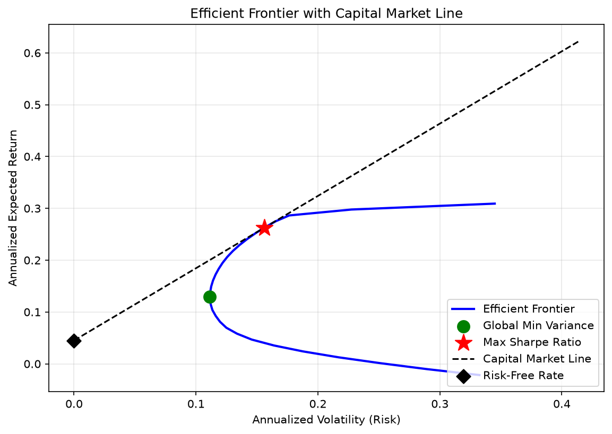
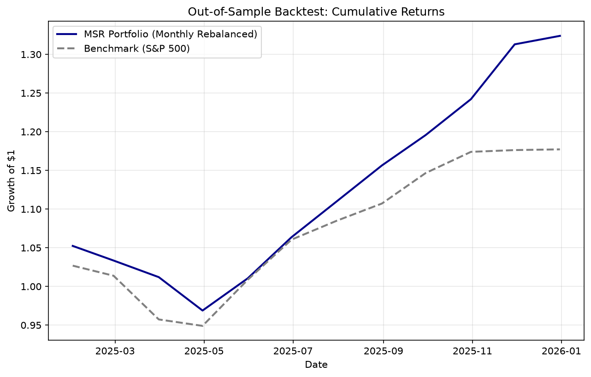

# Mean-Variance Portfolio Optimization with Efficient Frontier & Backtesting

Constructs the efficient frontier for a 15-stock portfolio using Modern Portfolio Theory (Markowitz), solves for the Global Minimum Variance and Maximum Sharpe Ratio portfolios via convex optimization, and backtests the strategy out-of-sample against the S&P 500.

<!--  — uncomment once you've run the pipeline and this file exists -->

> **Setup note:** `data/` ships empty. Run `python src/data_loader.py` first — it pulls real historical prices via `yfinance` and populates `data/stock_prices.csv`, `results/*.png`, and the performance summary. See [Quickstart](#quickstart) below. (`src/synthetic_data.py` is an optional offline stand-in, only useful if you don't have internet access when developing — not needed for normal use.)

## What this project demonstrates

- Modern Portfolio Theory: mean-variance optimization, efficient frontier construction
- Convex optimization in Python (`cvxpy`) with long-only, fully-invested constraints
- Backtesting methodology: out-of-sample evaluation, monthly rebalancing, benchmark comparison
- Standard performance metrics: Sharpe ratio, annualized return/volatility, max drawdown
- Clean separation of concerns: reusable `src/` modules + thin, readable notebooks

## Methodology

1. **Data**: Daily prices for 15 stocks (FAANG + blue chips across tech, financials, healthcare, consumer staples, energy, and industrials) plus the S&P 500 as a benchmark. Prices are resampled to monthly returns.
2. **Estimation**: Annualized mean returns and covariance matrix from monthly returns.
3. **Optimization** (`src/optimization.py`, via `cvxpy`):
   - **Global Minimum Variance (GMV)**: minimizes portfolio variance subject to `sum(weights) = 1`, `weights >= 0`.
   - **Efficient Frontier**: solves the minimum-variance problem across 30 target return levels spanning the achievable range.
   - **Maximum Sharpe Ratio (MSR)**: identified as the frontier point with the highest Sharpe ratio (the tangency portfolio).
   - **Capital Market Line**: drawn from the risk-free rate (3-month T-bill, ~4.5%) through the MSR portfolio.
4. **Backtest** (`src/backtest.py`): MSR weights are held out from the most recent ~1 year of data, rebalanced monthly back to target weights, and compared against a buy-and-hold S&P 500 benchmark.

## Results

Populated by running the pipeline (see Quickstart below) — `results/efficient_frontier.png`, `results/cumulative_returns.png`, and `results/performance_summary.txt` will contain your real numbers once you've pulled live data.

<!--
Once you've run the pipeline, paste your real results here, e.g.:

| Metric | MSR Portfolio | Benchmark (S&P 500) |
|---|---|---|
| Annualized Return | X% | X% |
| Annualized Volatility | X% | X% |
| Sharpe Ratio | X | X |
| Max Drawdown | X% | X% |


-->

## Key limitations (and why they matter)

Mean-variance optimization is famously sensitive to its inputs — small changes in estimated expected returns can produce large swings in optimal weights ("error maximization"). This project deliberately keeps scope intermediate: no Black-Litterman, no transaction costs, no leverage/sector constraints, no ML forecasting. The goal is a clean, correct baseline implementation, not a production trading strategy.

## Project structure

```
portfolio-optimization-efficient-frontier/
├── data/
│   └── stock_prices.csv          # Daily prices — generated by running src/data_loader.py
├── src/
│   ├── data_loader.py            # Fetch prices (yfinance), compute returns/covariance
│   ├── optimization.py           # GMV, MSR, efficient frontier (cvxpy)
│   ├── backtest.py               # Monthly rebalance, performance metrics
│   ├── visualization.py          # Efficient frontier plot, returns chart
│   └── synthetic_data.py         # DEMO ONLY — offline stand-in for yfinance
├── notebooks/
│   ├── 01_data_exploration.ipynb
│   ├── 02_portfolio_optimization.ipynb
│   └── 03_backtest_results.ipynb
├── configs/
│   ├── tickers.yaml               # 15-stock universe
│   └── params.yaml                # Risk-free rate, dates, rebalance frequency
├── results/
│   ├── efficient_frontier.png
│   ├── cumulative_returns.png
│   └── performance_summary.txt
├── README.md
└── requirements.txt
```

## Quickstart

```bash
git clone https://github.com/<your-username>/portfolio-optimization-efficient-frontier.git
cd portfolio-optimization-efficient-frontier
python -m venv venv && source venv/bin/activate    # Windows: venv\Scripts\activate
pip install -r requirements.txt

python src/data_loader.py                 # pulls real prices via yfinance -> data/stock_prices.csv
jupyter nbconvert --to notebook --execute --inplace notebooks/*.ipynb   # runs the full pipeline, populates results/
```

Or open the notebooks in Jupyter Lab and run them interactively:

```bash
jupyter notebook notebooks/
```

## Key interview questions this project prepares you for

1. What is the efficient frontier, and why is it curved?
2. Why use the covariance matrix instead of correlation in portfolio optimization?
3. What happens to the efficient frontier when you add a risk-free asset? (→ Capital Market Line)
4. Why is the max-Sharpe portfolio generally preferred over picking the single highest-return asset?
5. What's the main limitation of mean-variance optimization? (Sensitivity to input estimates; assumes normally distributed returns.)

## Tech stack

Python · pandas · NumPy · cvxpy · Matplotlib · yfinance
